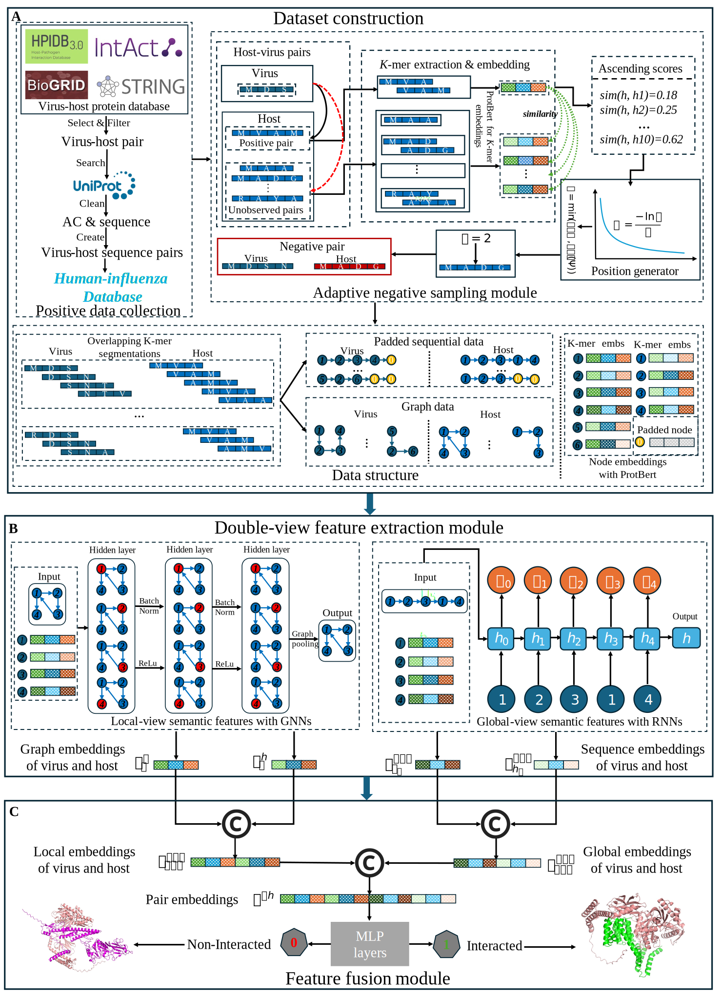

# SEHI-PPI
This repository is for Nature Communication journal submission.

## Summary
Influenza continues to pose significant global health threats, hijacking host cellular machinery through protein-protein interactions (PPIs), which are fundamental to viral entry, replication, immune evasion, and transmission. Yet, our understanding of these host-virus PPIs remains incomplete due to the vast diversity of viral proteins, their rapid mutation rates, and the limited availability of experimentally validated interaction data. Additionally, existing computational methods often struggle due to the limited availability of high-quality samples and their inability to effectively model the complex nature of host-virus interactions. To address these challenges, we present SEHI-PPI, an end-to-end framework for human-influenza PPI prediction. SEHI-PPI integrates a double-view deep learning architecture that captures both global and local sequence features, coupled with a novel adaptive negative sampling strategy to generate reliable and high-quality negative samples. Our method outperforms multiple benchmarks, including state-of-the-art large language models, achieving a superior performance in sensitivity (0.986) and AUROC (0.987). Notably, in a stringent test involving entirely unseen human and influenza protein families, SEHI-PPI maintains strong performance with an AUROC of 0.837. The model also demonstrates high generalizability across other human-virus PPI datasets, with an average sensitivity of 0.929 and AUROC of 0.928. Furthermore, AlphaFold3-guided case studies reveal that viral proteins predicted to target the same human protein cluster together structurally and functionally, underscoring the biological relevance of our predictions. These discoveries demonstrate the reliability of our SEHI-PPI framework in uncovering biologically meaningful host-virus interactions and potential therapeutic targets.

## Dataset
The interacted protein data can be found in the [Google Drive](https://drive.google.com/drive/folders/1-zBd1yDa92pXKNx6oACudsb7-cnuLQm8).

## Framework
In this work, we present SEHI-PPI, an end-to-end deep learning framework for predicting human–influenza protein–protein interactions (PPIs), integrating a novel double-view feature extraction method and an adaptive negative sampling strategy. The framework consists of three main components: a dataset construction module, a double-view feature extraction module, and a feature fusion module. Positive PPI pairs are collected from public databases, mapped to UniProtKB sequences, and combined with high-quality negative pairs generated using the proposed adaptive sampling strategy. Protein sequences are segmented into k-mers and encoded using pre-trained protein language models (PLMs) to produce both sequential and graph-based representations. Global features are extracted using recurrent neural networks (e.g., LSTM) to capture overall sequence patterns, while local features are learned through graph neural networks (e.g., GIN) to highlight key interaction-relevant regions. These global and local embeddings for human and influenza proteins are then concatenated and passed through multi-layer perceptrons (MLPs) to predict potential PPIs, enabling accurate identification of virus–host interactions.

## Citation
If you are interested in this work, please cita the work as bellow:

@article{yang2025sehi,
  title={SEHI-PPI: An End-to-End Sampling-Enhanced Human-Influenza Protein-Protein Interaction Prediction Framework with Double-View Learning},
  author={Yang, Qiang and Fan, Xiao and Zhao, Haiqing and Ma, Zhe and Stanifer, Megan L and Bian, Jiang and Salemi, Marco and Yin, Rui},
  journal={bioRxiv},
  pages={2025--03},
  year={2025},
  publisher={Cold Spring Harbor Laboratory}
}
